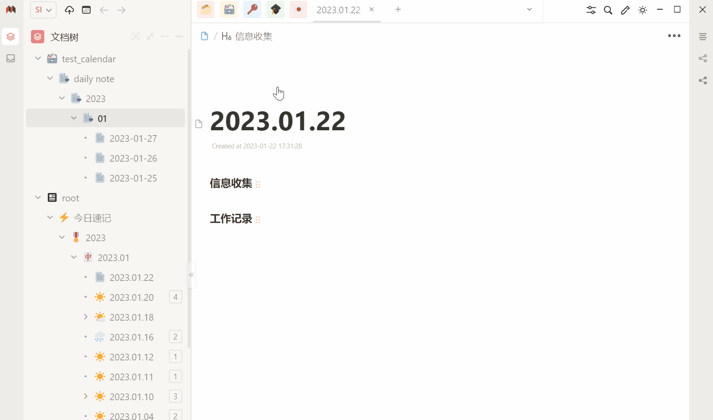

# SiYuan Calendar Panel | 思源日历面板

参考Obsidian日历插件设计制作，分享出来希望能帮到有同样需求的人。



原作者：[BryceAndJuly](https://ld246.com/member/BryceAndJuly)
原项目： [【分享】日历面板](https://ld246.com/article/1662969146166)

## 主题特性

* 日历面板用的是一个叫 [vue-calendar-component](https://ld246.com/forward?goto=https%3A%2F%2Fgithub.com%2FzwhGithub%2Fvue-calendar) 的组件，这个组件看着比较简洁；
* 通过 theme.js 将日历图标、日历挂件注入到指定位置，点击日历图标后弹出日历面板，点击面板外的区域来关闭日历。
* 日历挂件内，通过 SQL 遍历查询当月所有日期，检查是否有对应的日记文档（文档标题为：2022-10-12 格式，注意月份、日 都要有两位有效数字），给有对应日记文档的日期加上标记。切换月份后，执行同样的查询。
* 挂件内有个临时的对象 `this`，缓存以日期为键名，文档链接为键值的键值对，方便点击日历面板后能跳转到对应的日记文档。
* 右上角那个 多少日（比如：12日）的区域，点击后是刷新，切换到其他月份后想快速切回本月时点一下。

## 安装方法

[Savor主题](https://github.com/royc01/notion-theme)自带该功能，或选择

**手动安装：**

* 在[Release](https://github.com/HowcanoeWang/calendar/releases)中，下载对应的`calendar.zip`文件。
* 解压后，有一个`theme.js`，一个`calendar`文件夹。
* `calendar`放到挂件所在那个文件夹，`theme.js`放到所用主题那里，或者复制到已有的 `theme.js` 中（总共也没几行）。
* 清除缓存后刷新


如Savor有如下的文件夹目录结构：

```text
C:\Users\<user>\Documents\SiYuan\conf\appearance\themes\Savor\
├─calendar/  <-- 复制并替换这里
│  ├─...
│  ├─css/
│  └─js/
├─comment/
├─icon/
├─...
├─img/
├─style/
└─theme.js  <-- 替换或插入这里
```


## 版本记录

**反编译的纯js版本**

## v230121 (calendar-v7-fix)

* 参考 `js.map`中遗留的信息(`app.4e3d2b88.source.js`)，恢复压缩后的部分变量名，增加代码可读性
* 优化代码业务逻辑
* 如果缓存中没有默认日记本，则默认选择第一个打开的日记本
* 修复首次打开日历界面，无法加载日期数字下的小圆点
* 支持笔记本自定义模板路径
* 使用思源API，创建新日记时，使用笔记本模板
* 支持切换日记本时，自动加载对应的日记本配置选项

## calendar-v6-fix

* 解决日记根目录定死在 `daily notes`文件夹下，通过笔记本模板路径获取日记根目录
* 支持任意日期格式

> 详细：[notion-theme pull request 56](https://github.com/royc01/notion-theme/pull/56)

**之前的版本，基于Vue创建，源码已佚**

## v7: 解决创建日期文档后未自动标注的问题

* 之前的版本，点击日期创建对应文档后，需要手动刷新后才能看到新创建文档的日期被标注。改成创建完对应文档后，自动标注该日期。

## v6: 解决日记模板未正确渲染的问题

* 通过修改思源笔记本身的 `main.js`中挂载 `insertHTML`方法来实现模板的渲染

> 1.挂载的方法用于插入指定的日记模板；
>
> 2.不挂载也能创建指定日期的空白文档，只是不能自动插入对应模板。

## v5: 点击日期自动创建日记（使用指定模板）

* 右上角——【星期几】的位置，点击后，弹出已打开的笔记本，选中一个作为放置新创建日记的笔记本，会缓存到 LocalStorage 的 calendar_current_notebook 字段；
* 日记模板会使用笔记本-设置里设置的模板；
* 日记的路径直接使用默认的 `/daily note/2022/10/2022-10-01` 格式

## v4: 修复蓝框线不连贯的问题

* 之前日历面板的蓝框线，是多段下框线拼接成的，衔接处渲染的不连贯，有类似于小点的效果。看着有点不舒服，改成一条连贯的下框线。

## v3: 修理蓝框线被遮挡的问题

* 修理蓝框线被遮挡的问题

## v2: 小修改

* 日期标记改为数字下的小圆点
* 处理日期中，日数字小于 10 时无法跳转的问题

## v1: 初次提交

* 初次提交
